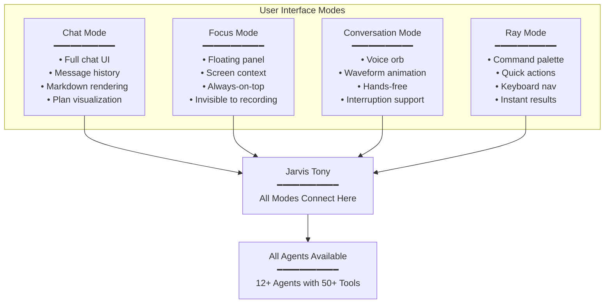
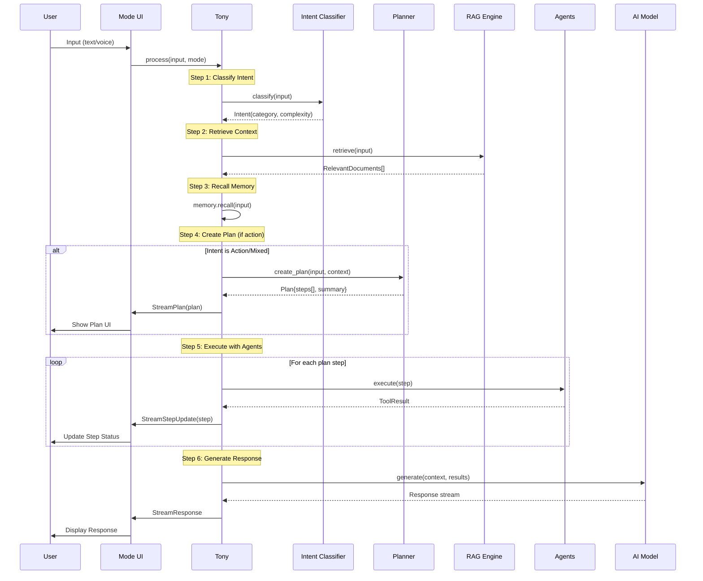
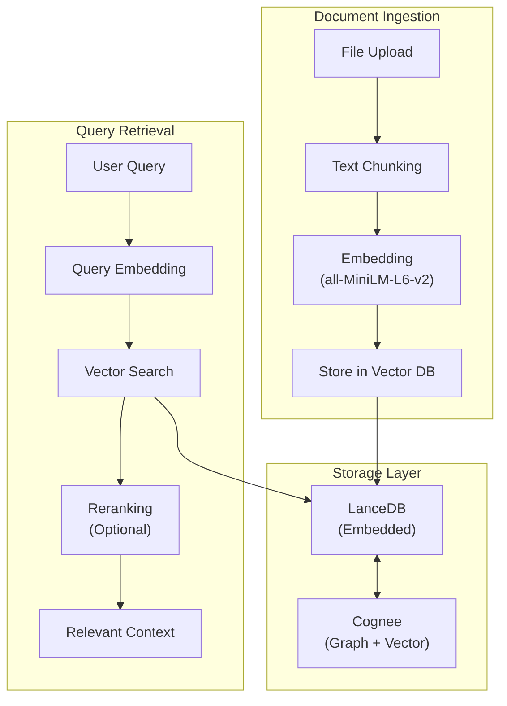
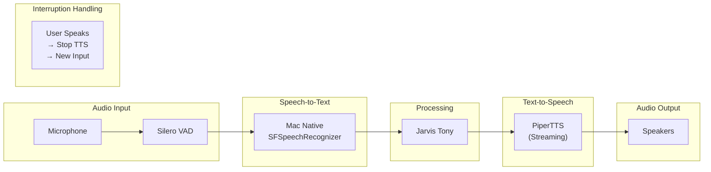

# Jarvis AI Assistant - Complete System Design

> **Date:** January 31, 2026 | **Version:** 3.0 | **Type:** Comprehensive System Architecture

---

## Executive Summary

This document provides **end-to-end system design** for Jarvis, covering every workflow, component, and connection. Jarvis transforms from a monolithic assistant into a **modular, agent-based system** orchestrated by **Jarvis Tony**.

### Core Architecture

```
┌─────────────────────────────────────────────────────────────────────────────────┐
│                           USER INTERFACE (SwiftUI)                              │
│  ┌─────────────┐  ┌─────────────┐  ┌─────────────┐  ┌─────────────┐            │
│  │ Chat Mode   │  │ Focus Mode  │  │ Conversation│  │  Ray Mode   │            │
│  │ (ChatGPT)   │  │  (Cluely)   │  │   (Siri)    │  │ (Spotlight) │            │
│  └──────┬──────┘  └──────┬──────┘  └──────┬──────┘  └──────┬──────┘            │
└─────────┼────────────────┼────────────────┼────────────────┼────────────────────┘
          │                │                │                │
          └────────────────┼────────────────┼────────────────┘
                           │                │
                           ▼                ▼
┌─────────────────────────────────────────────────────────────────────────────────┐
│                            JARVIS TONY (Orchestrator)                           │
│  ┌─────────────┐  ┌─────────────┐  ┌─────────────┐  ┌─────────────┐            │
│  │   Intent    │  │   Planner   │  │   Model     │  │  Memory     │            │
│  │ Classifier  │  │ (Reasoning) │  │   Router    │  │  Manager    │            │
│  └──────┬──────┘  └──────┬──────┘  └──────┬──────┘  └──────┬──────┘            │
└─────────┼────────────────┼────────────────┼────────────────┼────────────────────┘
          │                │                │                │
          ▼                ▼                ▼                ▼
┌─────────────────────────────────────────────────────────────────────────────────┐
│                              MCP AGENT REGISTRY                                 │
│  ┌──────────┐ ┌──────────┐ ┌──────────┐ ┌──────────┐ ┌──────────┐ ┌──────────┐ │
│  │Knowledge │ │  Web     │ │  System  │ │   App    │ │  Input   │ │ Browser  │ │
│  │   Base   │ │  Search  │ │  Control │ │  Manager │ │Simulator │ │Automation│ │
│  └──────────┘ └──────────┘ └──────────┘ └──────────┘ └──────────┘ └──────────┘ │
│  ┌──────────┐ ┌──────────┐ ┌──────────┐ ┌──────────┐ ┌──────────┐ ┌──────────┐ │
│  │   UI     │ │  Screen  │ │  Media   │ │ Shortcut │ │  File    │ │  Shell   │ │
│  │Automation│ │  Vision  │ │  Control │ │  Runner  │ │Processing│ │ Command  │ │
│  └──────────┘ └──────────┘ └──────────┘ └──────────┘ └──────────┘ └──────────┘ │
└─────────────────────────────────────────────────────────────────────────────────┘
```

---

## Table of Contents

1. [The 4 Modes (All Have Access to All Agents)](#1-the-4-modes)
2. [Jarvis Tony - The Orchestrator](#2-jarvis-tony-the-orchestrator)
3. [Reasoning & Planning Workflow](#3-reasoning--planning-workflow)
4. [RAG System (Knowledge Retrieval)](#4-rag-system)
5. [Complete Agent Registry (All Tools)](#5-complete-agent-registry)
6. [Voice Pipeline](#6-voice-pipeline)
7. [Memory System (Cognee)](#7-memory-system)
8. [Frontend Implementation](#8-frontend-implementation)
9. [Technology Stack](#9-technology-stack)
10. [Complete File Structure](#10-complete-file-structure)
11. [Implementation Phases](#11-implementation-phases)

---

## 1. The 4 Modes

> **All modes have access to ALL agents.** The mode only affects UI/UX, not capabilities.

### Mode Comparison

| Mode | Inspired By | UI Style | Primary UX | Voice |
|------|-------------|----------|------------|-------|
| **Chat** | ChatGPT | Full chat window, message bubbles | Conversation history, markdown rendering | Optional |
| **Focus** | Cluely | Floating overlay, always-on-top, translucent | Real-time screen context, non-intrusive | Optional |
| **Conversation** | Siri | Centered orb, waveform visualization | Voice-first, hands-free | Required |
| **Ray** | Spotlight/Raycast | Command palette, instant results | Quick actions, keyboard-driven | Optional |

### Mode Architecture



### 1.1 Chat Mode (ChatGPT-Inspired)

**Features:**
- Full-width chat interface with message bubbles
- Markdown rendering (code blocks, tables, lists)
- Plan visualization with step-by-step progress
- Message editing and regeneration
- File attachments and uploads
- Conversation history with search

**Liquid Glass UI:**
```swift
// Chat bubble with glass effect
struct ChatBubbleView: View {
    let message: Message
    
    var body: some View {
        Text(message.content)
            .padding()
            .glassEffect(.regular, in: .rect(cornerRadius: 16))
            .frame(maxWidth: 500, alignment: message.isUser ? .trailing : .leading)
    }
}
```

### 1.2 Focus Mode (Cluely-Inspired)

**Features:**
- Small floating overlay (300x400px default)
- Always-on-top, draggable positioning
- **Screen context awareness** - reads current screen content
- Translucent glass effect, invisible to screen recording
- Auto-hide during meetings/recordings
- Quick keyboard shortcuts (CMD+\)

**Liquid Glass UI:**
```swift
// Floating Focus panel
struct FocusPanelView: View {
    @State private var position = CGPoint(x: 50, y: 200)
    
    var body: some View {
        VStack(spacing: 12) {
            InputField()
            ResponseView()
        }
        .frame(width: 320)
        .padding()
        .glassEffect(.thin, in: .rect(cornerRadius: 20))
        .position(position)
        .gesture(DragGesture().onChanged { position = $0.location })
        .opacity(0.95)
    }
}
```

### 1.3 Conversation Mode (Siri-Inspired)

**Features:**
- Centered voice orb with waveform animation
- Voice activity indicator
- Hands-free operation
- Interruption handling (speak to stop response)
- Compact text display of transcription
- Wake word support (optional)

**Liquid Glass UI:**
```swift
// Voice orb with animation
struct VoiceOrbView: View {
    @State private var isListening = false
    
    var body: some View {
        ZStack {
            // Glass background
            Circle()
                .fill(.ultraThinMaterial)
                .glassEffect(.prominent, in: .circle)
                .frame(width: 120, height: 120)
            
            // Waveform animation
            WaveformView(isActive: isListening)
                .frame(width: 80, height: 40)
        }
    }
}
```

### 1.4 Ray Mode (Spotlight/Raycast-Inspired)

**Features:**
- Command palette (single input line)
- Instant search results
- Keyboard navigation (arrow keys)
- Quick actions (apps, files, web, commands)
- Extensions/plugins support
- Results with icons and descriptions

**Liquid Glass UI:**
```swift
// Ray command palette
struct RayPaletteView: View {
    @State private var query = ""
    @State private var results: [RayResult] = []
    
    var body: some View {
        VStack(spacing: 0) {
            // Input
            TextField("Ask Jarvis...", text: $query)
                .font(.title2)
                .padding()
            
            Divider()
            
            // Results
            ScrollView {
                ForEach(results) { result in
                    RayResultRow(result: result)
                }
            }
        }
        .frame(width: 600, height: min(CGFloat(results.count * 50 + 60), 400))
        .glassEffect(.regular, in: .rect(cornerRadius: 16))
    }
}
```

---

## 2. Jarvis Tony - The Orchestrator

### Architecture

```python
# backend/core/tony.py
class JarvisTony:
    """
    Central orchestrator - named after Tony Stark.
    Controls all planning, routing, and agent coordination.
    """
    
    def __init__(self):
        # Core components
        self.intent_classifier = SetFitClassifier()    # Local, fast
        self.planner = ReasoningPlanner()               # Creates execution plans
        self.model_router = ModelRouter()               # Selects AI model
        self.agent_registry = MCPAgentRegistry()        # All agents
        self.memory = CogneeMemory()                    # GraphRAG
        self.rag = RAGEngine()                          # Knowledge retrieval
```

### Complete Workflow



### Tony Implementation

```python
# backend/core/tony.py
from typing import AsyncIterator
from pydantic import BaseModel
from .planner import ReasoningPlanner, Plan, PlanStep
from .intent import SetFitClassifier, Intent
from .rag import RAGEngine
from .memory import CogneeMemory
from agents.registry import MCPAgentRegistry

class TonyResponse(BaseModel):
    type: str  # "plan" | "step_update" | "content" | "tool_call" | "error"
    data: dict

class JarvisTony:
    """Central orchestrator for Jarvis."""
    
    def __init__(self):
        self.classifier = SetFitClassifier()
        self.planner = ReasoningPlanner()
        self.rag = RAGEngine()
        self.memory = CogneeMemory()
        self.agents = MCPAgentRegistry()
        self.model_router = ModelRouter()
    
    async def process(
        self,
        user_input: str,
        mode: str,
        context: dict = None
    ) -> AsyncIterator[TonyResponse]:
        """Main entry point - ALL modes use this."""
        
        # 1. Classify intent (local, ~5ms)
        intent = self.classifier.classify(user_input)
        
        # 2. Retrieve relevant knowledge (RAG)
        rag_context = await self.rag.retrieve(user_input, top_k=5)
        
        # 3. Recall relevant memories
        memories = await self.memory.recall(user_input, limit=5)
        
        # 4. Create plan if action needed
        plan = None
        if intent.category in ["action", "mixed"]:
            plan = await self.planner.create_plan(
                user_input=user_input,
                intent=intent,
                context=rag_context,
                available_agents=self.agents.list_all()
            )
            
            # Stream plan to UI
            yield TonyResponse(
                type="plan",
                data={"summary": plan.summary, "steps": plan.steps}
            )
        
        # 5. Select model based on complexity
        model = self.model_router.select(
            complexity=intent.complexity,
            has_plan=plan is not None,
            mode=mode
        )
        
        # 6. Execute plan steps (if any)
        if plan:
            for i, step in enumerate(plan.steps):
                # Update step status to running
                yield TonyResponse(
                    type="step_update",
                    data={"step_id": step.id, "status": "running"}
                )
                
                # Execute step
                result = await self._execute_step(step)
                
                # Update step status to completed
                yield TonyResponse(
                    type="step_update",
                    data={"step_id": step.id, "status": "completed", "result": result}
                )
        
        # 7. Generate response
        async for chunk in self._generate_response(
            user_input=user_input,
            intent=intent,
            rag_context=rag_context,
            memories=memories,
            plan_results=plan.results if plan else [],
            model=model
        ):
            yield TonyResponse(type="content", data={"text": chunk})
        
        # 8. Store in memory
        await self.memory.store(user_input, context)
```

---

## 3. Reasoning & Planning Workflow

### Plan Structure (Current Jarvis Preserved)

```python
# backend/core/planner.py
from pydantic import BaseModel
from typing import List, Optional

class PlanStep(BaseModel):
    id: str                    # "step_1", "step_2", etc.
    description: str           # Human-readable description
    tool_name: Optional[str]   # Agent tool to use
    tool_args: dict = {}       # Arguments for tool
    status: str = "pending"    # pending | running | completed | failed
    result: Optional[str]      # Result after execution

class Plan(BaseModel):
    summary: str               # Brief description of the plan
    steps: List[PlanStep]
    total_steps: int

class ReasoningPlanner:
    """Creates structured execution plans."""
    
    PLANNER_PROMPT = """You are a planning assistant for Jarvis.
Create a step-by-step plan to accomplish the user's request.

Context:
- Intent: {intent}
- Available agents and tools: {agents}
- Relevant knowledge: {context}

Rules:
1. Each step should be atomic (one action)
2. Include verification steps when needed
3. Maximum 6 steps for complex tasks
4. Always have a final summary step

User request: {user_input}

Respond in JSON:
{{
    "summary": "Brief description of what we'll do",
    "steps": [
        {{
            "id": "step_1",
            "description": "What this step does",
            "tool_name": "agent.tool_name or null",
            "tool_args": {{}}
        }}
    ]
}}
"""
    
    async def create_plan(
        self,
        user_input: str,
        intent: Intent,
        context: list,
        available_agents: list
    ) -> Plan:
        """Generate execution plan using LLM."""
        prompt = self.PLANNER_PROMPT.format(
            intent=intent,
            agents=available_agents,
            context=context,
            user_input=user_input
        )
        
        response = await self.llm.generate(prompt, json_mode=True)
        plan_data = json.loads(response)
        
        return Plan(
            summary=plan_data["summary"],
            steps=[PlanStep(**s) for s in plan_data["steps"]],
            total_steps=len(plan_data["steps"])
        )
```

### Plan UI Visualization

```swift
// frontend/Views/Components/PlanView.swift
struct PlanView: View {
    @ObservedObject var viewModel: UnifiedViewModel
    
    var body: some View {
        VStack(alignment: .leading, spacing: 8) {
            // Plan header
            Text(viewModel.currentPlan?.summary ?? "")
                .font(.headline)
            
            // Steps
            ForEach(viewModel.currentPlan?.steps ?? []) { step in
                HStack {
                    // Status icon
                    stepStatusIcon(step.status)
                    
                    // Description
                    Text(step.description)
                        .foregroundColor(step.status == "pending" ? .secondary : .primary)
                    
                    Spacer()
                    
                    // Progress indicator for running step
                    if step.status == "running" {
                        ProgressView()
                            .scaleEffect(0.7)
                    }
                }
                .padding(.vertical, 4)
            }
        }
        .padding()
        .glassEffect(.thin, in: .rect(cornerRadius: 12))
    }
    
    func stepStatusIcon(_ status: String) -> some View {
        Group {
            switch status {
            case "completed":
                Image(systemName: "checkmark.circle.fill")
                    .foregroundColor(.green)
            case "running":
                Image(systemName: "arrow.right.circle.fill")
                    .foregroundColor(.blue)
            case "failed":
                Image(systemName: "xmark.circle.fill")
                    .foregroundColor(.red)
            default:
                Image(systemName: "circle")
                    .foregroundColor(.gray)
            }
        }
    }
}
```

---

## 4. RAG System

### Architecture



### RAG Implementation

```python
# backend/core/rag.py
from sentence_transformers import SentenceTransformer
import lancedb
from pathlib import Path

class RAGEngine:
    """Knowledge retrieval with vector search."""
    
    def __init__(self):
        # Embedding model (runs locally)
        self.embedder = SentenceTransformer('all-MiniLM-L6-v2')
        
        # Vector database (embedded, no server)
        self.db = lancedb.connect("data/lancedb")
        
        # Create table if not exists
        self._init_table()
    
    def _init_table(self):
        """Initialize the knowledge base table."""
        if "knowledge" not in self.db.table_names():
            self.db.create_table(
                "knowledge",
                schema={
                    "text": str,
                    "source": str,
                    "chunk_id": int,
                    "vector": self.embedder.get_sentence_embedding_dimension()
                }
            )
    
    async def add_document(self, text: str, source: str):
        """Add document to knowledge base with chunking."""
        chunks = self._chunk_text(text, chunk_size=500, overlap=50)
        
        for i, chunk in enumerate(chunks):
            embedding = self.embedder.encode(chunk).tolist()
            self.db["knowledge"].add([{
                "text": chunk,
                "source": source,
                "chunk_id": i,
                "vector": embedding
            }])
    
    async def retrieve(self, query: str, top_k: int = 5) -> list:
        """Retrieve relevant documents."""
        query_embedding = self.embedder.encode(query).tolist()
        
        results = self.db["knowledge"].search(query_embedding).limit(top_k).to_list()
        
        return [
            {"text": r["text"], "source": r["source"], "score": r["_distance"]}
            for r in results
        ]
    
    def _chunk_text(self, text: str, chunk_size: int, overlap: int) -> list:
        """Split text into overlapping chunks."""
        words = text.split()
        chunks = []
        
        for i in range(0, len(words), chunk_size - overlap):
            chunk = " ".join(words[i:i + chunk_size])
            chunks.append(chunk)
        
        return chunks
```

### RAG Use Cases

| Use Case | How RAG Helps |
|----------|---------------|
| **Question Answering** | Retrieves relevant facts from uploaded documents |
| **Mac Automation** | Retrieves AppleScript patterns from knowledge base |
| **Code Help** | Retrieves code snippets and documentation |
| **Personal Knowledge** | Retrieves user's notes, preferences, files |
| **Conversation Context** | Retrieves past conversation summaries |

---

## 5. Complete Agent Registry

### All Agents (Expanded from Current tools.py)

| Agent | Tools Count | Description |
|-------|-------------|-------------|
| **Knowledge Base Agent** | 3 | Search, add, manage knowledge |
| **Web Search Agent** | 2 | DuckDuckGo search, URL fetch |
| **Mac Automation Agent** | 4 | Run scripts, AppleScript, shell |
| **Input Simulation Agent** | 4 | Click, type, keyboard, mouse |
| **App Lifecycle Agent** | 6 | Launch, quit, hide, get apps |
| **Window Manager Agent** | 3 | Resize, move, arrange windows |
| **Browser Automation Agent** | 12 | Navigate, click, fill, scroll |
| **Screen Vision Agent** | 3 | Capture, analyze, read text |
| **UI Automation Agent** | 3 | Click elements, get UI tree |
| **Media Control Agent** | 2 | Play/pause, get now playing |
| **File Processing Agent** | 4 | Read, write, search files |
| **System Control Agent** | 4 | Volume, notifications, state |
| **Shortcut Runner Agent** | 2 | Run/list macOS Shortcuts |

**Total: 13 Agents with 52 Tools**

### Agent Implementations

```python
# backend/agents/mac_automation/agent.py
class MacAutomationAgent(BaseAgent):
    """Mac system automation via scripts."""
    
    def __init__(self):
        super().__init__("mac_automation", "Mac Automation")
    
    def get_tools(self):
        return [
            Tool("run_mac_script", self.run_script, 
                 "Execute pre-defined Mac automation script"),
            Tool("execute_applescript", self.execute_applescript,
                 "Run custom AppleScript code"),
            Tool("execute_shell_command", self.execute_shell,
                 "Run shell command (safe commands only)"),
            Tool("get_available_scripts", self.list_scripts,
                 "List available automation scripts"),
        ]
```

```python
# backend/agents/browser/agent.py  
class BrowserAutomationAgent(BaseAgent):
    """Browser automation for Safari/Chrome."""
    
    def get_tools(self):
        return [
            Tool("browser_navigate", self.navigate, "Navigate to URL"),
            Tool("browser_new_tab", self.new_tab, "Open new tab"),
            Tool("browser_scroll", self.scroll, "Scroll page"),
            Tool("browser_search_page", self.search_on_page, "Find on page"),
            Tool("browser_click_link", self.click_link, "Click link by text"),
            Tool("browser_type_search", self.type_search, "Type in search"),
            Tool("browser_get_info", self.get_page_info, "Get page info"),
            Tool("browser_submit", self.submit_form, "Submit form"),
            Tool("web_get_elements", self.get_elements, "List interactive elements"),
            Tool("web_click_element", self.click_element, "Click element"),
            Tool("web_get_content", self.get_content, "Get page text"),
            Tool("web_fill_input", self.fill_input, "Fill input field"),
        ]
```

### MCP Registration

```python
# backend/agents/registry.py
class MCPAgentRegistry:
    """Central registry for all agents."""
    
    def __init__(self):
        self.agents = {}
        self._register_all()
    
    def _register_all(self):
        """Register all built-in agents."""
        from agents.knowledge import KnowledgeBaseAgent
        from agents.web_search import WebSearchAgent
        from agents.mac_automation import MacAutomationAgent
        from agents.input_simulation import InputSimulationAgent
        from agents.app_lifecycle import AppLifecycleAgent
        from agents.window_manager import WindowManagerAgent
        from agents.browser import BrowserAutomationAgent
        from agents.screen_vision import ScreenVisionAgent
        from agents.ui_automation import UIAutomationAgent
        from agents.media_control import MediaControlAgent
        from agents.file_processing import FileProcessingAgent
        from agents.system_control import SystemControlAgent
        from agents.shortcut_runner import ShortcutRunnerAgent
        
        for agent_class in [
            KnowledgeBaseAgent,
            WebSearchAgent,
            MacAutomationAgent,
            InputSimulationAgent,
            AppLifecycleAgent,
            WindowManagerAgent,
            BrowserAutomationAgent,
            ScreenVisionAgent,
            UIAutomationAgent,
            MediaControlAgent,
            FileProcessingAgent,
            SystemControlAgent,
            ShortcutRunnerAgent,
        ]:
            agent = agent_class()
            self.agents[agent.id] = agent
    
    def get_tools_for_intent(self, intent: Intent) -> list:
        """Get all relevant tools for an intent."""
        tools = []
        for agent in self.agents.values():
            if agent.can_handle(intent):
                tools.extend(agent.get_tools())
        return tools
```

---

## 6. Voice Pipeline

### Pipecat Architecture



### Implementation

```python
# backend/voice/pipeline.py
from pipecat.pipeline import Pipeline
from pipecat.vad import SileroVADAnalyzer
from pipecat.services.piper import PiperTTSService

class JarvisVoicePipeline:
    """Full-duplex voice with interruption handling."""
    
    def __init__(self, tony: JarvisTony):
        self.tony = tony
        
        # VAD - Silero (open source, CPU efficient)
        self.vad = SileroVADAnalyzer(
            sample_rate=16000,
            min_speech_duration_ms=250,
            max_silence_duration_ms=500
        )
        
        # TTS - PiperTTS (streaming, open source)
        self.tts = PiperTTSService(
            voice="en_US-lessac-medium",
            sample_rate=22050
        )
        
        # Interruption state
        self.is_speaking = False
    
    async def handle_audio_input(self, audio: bytes):
        """Process incoming audio."""
        # VAD detects speech
        if self.vad.is_speech(audio):
            if self.is_speaking:
                # Interrupt current TTS
                await self.tts.stop()
                self.is_speaking = False
            
            # Transcribe with Mac STT
            text = await self.transcribe(audio)
            
            # Process with Tony
            async for response in self.tony.process(text, mode="conversation"):
                if response.type == "content":
                    await self.speak(response.data["text"])
    
    async def speak(self, text: str):
        """Speak with streaming TTS."""
        self.is_speaking = True
        async for audio_chunk in self.tts.stream(text):
            if not self.is_speaking:
                break
            await self.play(audio_chunk)
        self.is_speaking = False
```

---

## 7. Memory System

### Cognee Integration

```python
# backend/memory/cognee_memory.py
from cognee import Cognee
import os

# Use embedded databases (no Docker)
os.environ["GRAPH_DATABASE_PROVIDER"] = "kuzu"
os.environ["VECTOR_DATABASE_PROVIDER"] = "lancedb"

class CogneeMemory:
    """GraphRAG memory with entity extraction."""
    
    def __init__(self):
        self.engine = Cognee()
    
    async def store(self, content: str, context: dict = None):
        """Store with automatic entity extraction."""
        await self.engine.add(content, metadata=context or {})
        await self.engine.cognify()  # Extract entities and relations
    
    async def recall(self, query: str, limit: int = 5) -> list:
        """Hybrid retrieval (graph + vector)."""
        return await self.engine.search(query, limit=limit)
    
    async def get_related(self, entity: str) -> list:
        """Get entities related to this one."""
        return await self.engine.get_graph_neighbors(entity)
```

---

## 8. Frontend Implementation

### Unified ViewModel

```swift
// frontend/ViewModels/UnifiedViewModel.swift
@MainActor
class UnifiedViewModel: ObservableObject {
    // Mode
    @Published var currentMode: Mode = .chat
    
    // Conversation
    @Published var messages: [Message] = []
    @Published var inputText = ""
    @Published var isProcessing = false
    
    // Plan
    @Published var currentPlan: Plan?
    @Published var planSteps: [PlanStep] = []
    
    // Voice
    @Published var isListening = false
    @Published var isSpeaking = false
    
    // Backend client
    private let tony = TonyClient()
    
    func process() async {
        isProcessing = true
        
        for await response in tony.stream(inputText, mode: currentMode) {
            switch response.type {
            case "plan":
                currentPlan = Plan(from: response.data)
            case "step_update":
                updateStep(response.data)
            case "content":
                appendContent(response.data["text"])
            default:
                break
            }
        }
        
        isProcessing = false
    }
}
```

---

## 9. Technology Stack

### Complete Stack

| Layer | Technology | Version | Notes |
|-------|------------|---------|-------|
| **Frontend** | SwiftUI | macOS 26 | Liquid Glass UI |
| **Backend** | FastAPI | 0.109+ | Async, WebSocket |
| **Orchestrator** | LangGraph | 0.1+ | State management |
| **Intent** | SetFit | 1.0+ | Local classification |
| **Embedding** | all-MiniLM-L6-v2 | Latest | Local, fast |
| **Vector DB** | LanceDB | 0.5+ | Embedded |
| **Memory** | Cognee | 0.1+ | GraphRAG |
| **Voice** | Pipecat | 0.0.20+ | Pipeline |
| **VAD** | Silero | 4.0+ | CPU efficient |
| **TTS** | PiperTTS | 1.2+ | Streaming |
| **STT** | Mac Native | macOS 26 | Free |
| **LLM** | OpenAI API | Latest | Primary |
| **Local LLM** | Ollama | Latest | Fallback |

---

## 10. Complete File Structure

```
jarvis/
├── backend/
│   ├── core/
│   │   ├── tony.py              # Main orchestrator
│   │   ├── planner.py           # Reasoning planner
│   │   ├── intent.py            # SetFit classifier
│   │   ├── rag.py               # RAG engine
│   │   ├── model_router.py      # Model selection
│   │   └── config.py
│   │
│   ├── agents/
│   │   ├── registry.py          # MCP registry
│   │   ├── base.py              # Base agent class
│   │   ├── knowledge/           # Knowledge base agent
│   │   ├── web_search/          # Web search agent
│   │   ├── mac_automation/      # Mac scripts agent
│   │   ├── input_simulation/    # Keyboard/mouse agent
│   │   ├── app_lifecycle/       # App management agent
│   │   ├── window_manager/      # Window control agent
│   │   ├── browser/             # Browser automation agent
│   │   ├── screen_vision/       # Screen capture agent
│   │   ├── ui_automation/       # UI element agent
│   │   ├── media_control/       # Media playback agent
│   │   ├── file_processing/     # File operations agent
│   │   ├── system_control/      # System settings agent
│   │   └── shortcut_runner/     # macOS Shortcuts agent
│   │
│   ├── memory/
│   │   └── cognee_memory.py     # Cognee integration
│   │
│   ├── voice/
│   │   ├── pipeline.py          # Pipecat pipeline
│   │   └── tts.py               # PiperTTS wrapper
│   │
│   ├── api/
│   │   ├── routes/
│   │   │   ├── chat.py
│   │   │   ├── voice.py
│   │   │   └── agents.py
│   │   └── websocket.py
│   │
│   └── main.py
│
├── frontend/
│   └── JarvisAI/
│       ├── Core/
│       │   ├── Theme.swift       # Liquid Glass
│       │   └── TonyClient.swift
│       ├── ViewModels/
│       │   └── UnifiedViewModel.swift
│       ├── Views/
│       │   ├── ChatModeView.swift
│       │   ├── FocusModeView.swift
│       │   ├── ConversationModeView.swift
│       │   ├── RayModeView.swift
│       │   └── Components/
│       │       └── PlanView.swift
│       └── Services/
│           └── SpeechRecognition.swift
│
└── data/
    ├── lancedb/                  # Vector storage
    └── cognee/                   # Memory storage
```

---

## 11. Implementation Phases

| Phase | Weeks | Focus | Deliverables |
|-------|-------|-------|--------------|
| **1** | 1-2 | Tony Core | Orchestrator, planner, intent |
| **2** | 3-4 | Agents | All 13 agents migrated |
| **3** | 5 | RAG | LanceDB, document ingestion |
| **4** | 6 | Memory | Cognee integration |
| **5** | 7 | Voice | Pipecat pipeline |
| **6** | 8 | Frontend | 4 modes with Liquid Glass |

---

## Summary

This architecture provides:

1. ✅ **4 Modes** - Chat, Focus, Conversation, Ray (all with agent access)
2. ✅ **Tony Orchestrator** - Central control with planning
3. ✅ **13 Agents** - All 52 tools organized modularly
4. ✅ **RAG System** - Vector search for knowledge retrieval
5. ✅ **Plan Execution UI** - Step-by-step visualization
6. ✅ **Voice Pipeline** - Interruption handling, streaming
7. ✅ **Memory** - Persistent GraphRAG with Cognee
8. ✅ **All Open Source** - Except OpenAI API

Every component connects through Tony, ensuring consistent behavior across all modes.
